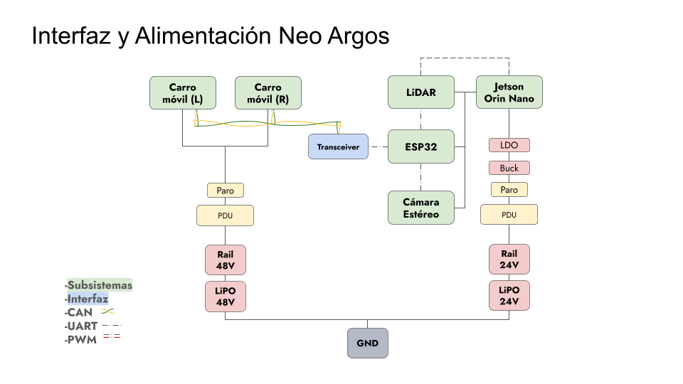

# 🏗️ System Architecture

### [🏠 Home](../) | [📺 Demo](../demo) | [🏗️ Architecture](./)

---

## 🗺️ System Connections

*Figure 1: High-level overview of Interfaces and Power Distribution (CAN, UART, Power Unit).*

## 🔌 Hardware Subsystems
### 💻 Main Controller (The Brain)
*   **Jetson Orin Nano (8GB):** Handles high-level ROS 2 nodes, SLAM processing, and navigation planning. Communication with developer laptops is maintained via **SSH** for real-time monitoring.

### 🧠 Low-Level Control (The Heart)
*   **ESP32 with micro-ROS:** Acts as the bridge between the high-level ROS 2 environment and the physical motors.
*   **Low-Level Control Board:** A custom-designed board for micro-ROS logic and signal management.
*   **Power Distribution Interface (PDI):** A custom PCB that consolidates power electronics, buttons, and safe distribution for the LiPo batteries.

### ⚙️ Actuation & Chassis
*   **Motors:** 2x AK10 Brushless motors with built-in controllers, communicating via **CANopen**.
*   **Wheels:** Rear-wheel differential drive with two front caster wheels for stability.
*   **Frame:** 10mm CNC-machined aluminum plates with strategic cutouts for cable routing and weight reduction.

### 👁️ Sensors
*   **RPLiDAR-A1:** Centrally mounted for 360° obstacle detection and mapping.
*   **Intel RealSense D435i:** Depth and RGB camera for obstacle avoidance and future computer vision tasks.

## 🧠 Software Stack
The Neo-Argos stack is built for real-time responsiveness and autonomous reliability.

1.  **Perception:** IMU (via D435i) and Lidar data feed into the `slam_toolbox`.
2.  **Odometry:** Fusion of motor encoders and IMU data using the `robot_localization` package (EKF).
3.  **Navigation:** **Nav2** manages global/local path planning and obstacle avoidance.
4.  **Hardware Bridge:** Custom C++ library for CANopen communication running on the ESP32 (micro-ROS).

---
[See Neo-Argos in Action →](../demo)
