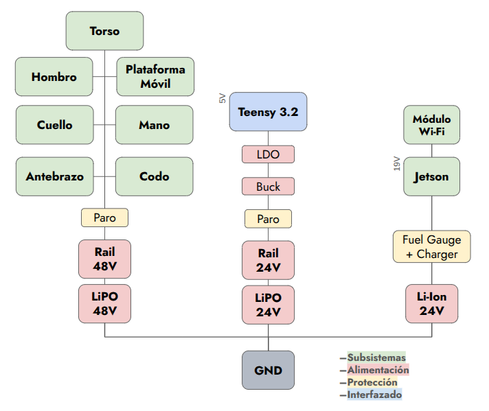
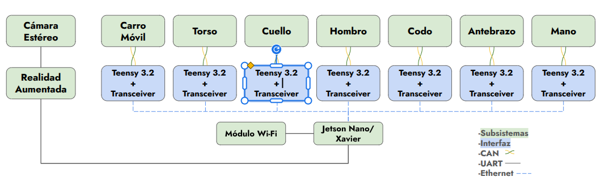

# 🏗️ System Architecture

### [🏠 Home](../) | [📺 Demo](../demo) | [🏗️ Architecture](./) | [📄 Documentation](../documentation)

---

## 🗺️ System Overview

  

    
    
<em>Figure 1: Interaction between Hardware, Firmware, and Cloud layers.</em>

  

  

    
    
<em>Figure 2: Interaction between Hardware, Firmware, and Cloud layers.</em>

  

## 🔌 Hardware Subsystems
*   **Main Controller(Avatar):**
    - Single Board Computer
    - Stereo Camera
    - Tablet
    - MCU 32 bits ARM Cortex M4
*   **Main Controller(Operator):** 
    - Computer(Laptop)
    - Head Mounted Goggles
    - VR Controllers
    - Control and Feedback Gloves
    - Wireless Trackers
    - Pedal Board 
*   **Actuation:**
    - Brushless CAN Motors
    - Linear Servo Motors
*   **Power:**
    - LiPo Batteries

## 🧠 Software Logic

The software stack is built on:
- **C++ (Arduino IDE)** for MCU programming.
- **C# (Unity)** for vision and VR systems.

1. **Perception Layer:** Trackers are used to estimate the operator’s pose through Light tracking. Vision data is streamed to provide real-time visual feedback.
2. **Decision Layer:** Inverse Kinematics calculations transform Cartesian poses into joint-space targets. A Finite Stete Machine handles transition between states like Calibrated, GoToHome, and Engaged.
3. **Execution Layer:** Operator pose data is transmitted over UDP to the single-board computer (SBC), where it is processed and routed to multiple microcontroller units (MCUs) via serial communication. Each MCU then forwards the control signals to the actuators using the CAN bus protocol.

 

---
[Review Technical Documents →](../documentation)