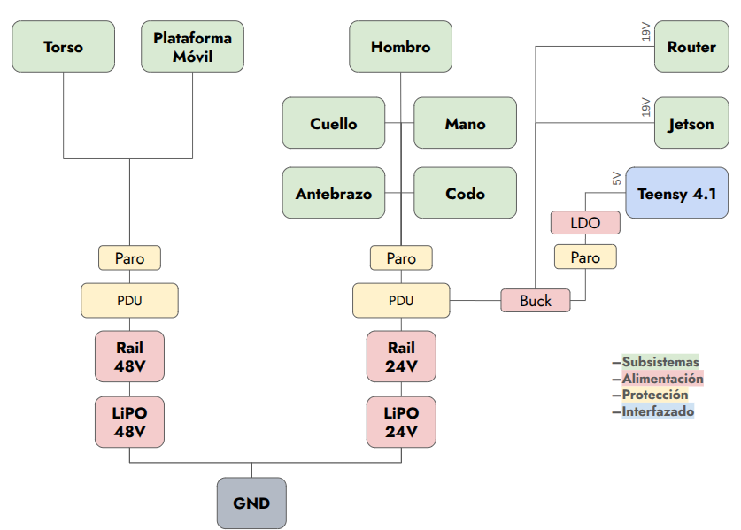
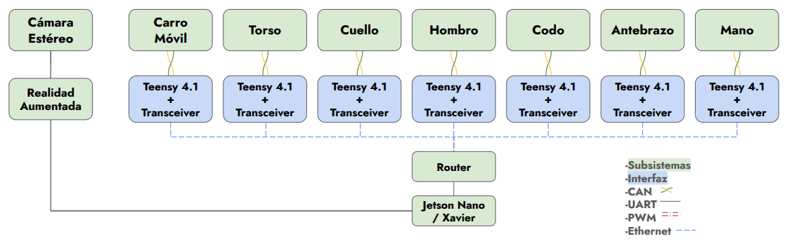

# 🏗️ System Architecture

### [🏠 Home](../) | [📺 Demo](../demo) | [🏗️ Architecture](./) | [📄 Documentation](../documentation)

---

## 🗺️ System Overview

  

    
    
<em>Figure 1: System Power Distribution Diagram.</em>

  

  

    
    
<em>Figure 2: System Communication Diagram.</em>

  

## 🔌 Hardware Subsystems
*   **Main Controller(Avatar):**
    - Single Board Computer
    - Router
    - Stereo Camera
    - Tablet
    - MCU 32 bits ARM Cortex-M7
*   **Main Controller(Operator):** 
    - Computer(Laptop)
    - Head Mounted Goggles
    - Actuated exoskeleton
    - Control and Feedback Gloves
    - Wireless Trackers
    - Pedal Board 
*   **Actuation:**
    - Brushless CAN Motors
*   **Power:**
    - LiPo Batteries

## 🧠 Software Logic

The software stack is built on:
- **C++ (Platformio/Arduino Framework)** for MCU programming.
- **C# (Unity)** for vision and VR systems.

1. **Perception Layer:** Operator pose estimation is achieved using an actuated exoskeleton equipped with joint encoders that provide precise angular measurements for real-time kinematic reconstruction. The system also delivers haptic force feedback, allowing the operator to perceive interaction forces. When the robot manipulates heavy loads, the exoskeleton generates proportional resistance, conveying the equivalent muscular effort to the user.
2. **Decision Layer:** Inverse Kinematics calculations transform Cartesian poses into joint-space targets. A Finite Stete Machine handles transition between states like Calibrated, GoToHome, and Engaged.
3. **Execution Layer:** Operator pose and effort data are transmitted through UDP packets to the MCUs. The microcontrollers process the incoming data and compute the corresponding current control signals, which are applied to the robot’s motors to achieve the commanded motion and force response.

 

---
[Review Technical Documents →](../documentation)