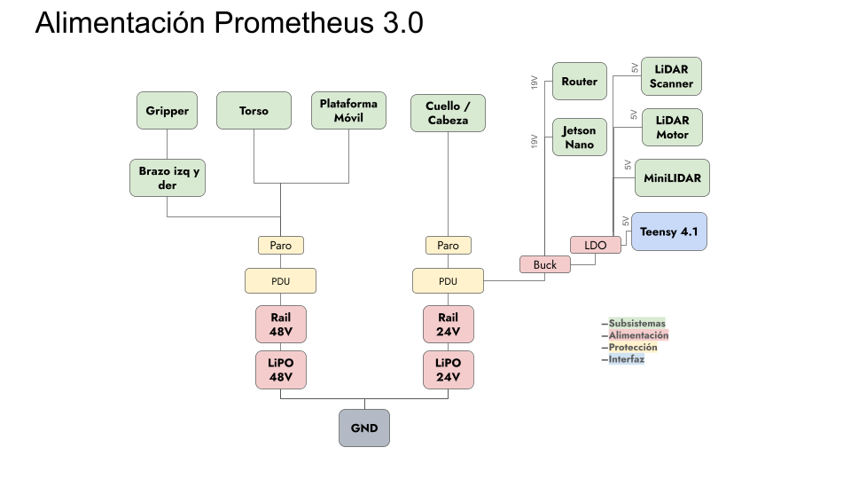
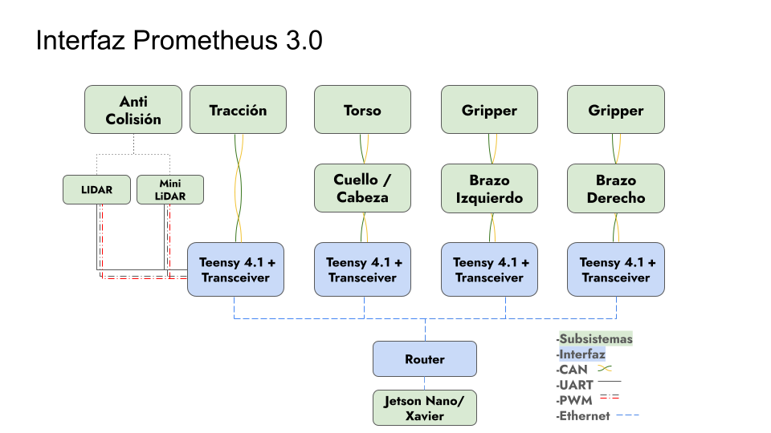

# 🏗️ System Architecture

### [🏠 Home](../) | [📺 Demo](../demo) | [🏗️ Architecture](./) | [📄 Documentation](../documentation)

---

## 🗺️ System Overview
The Prometheus 3.0 system is divided into two primary environments: the **Operator side (Hermes)** and the **Robot side (Avatar)**.

## 🔌 Hardware Subsystems
*   **Robot Controllers (Avatar):** Multiple **Teensy 4.1** microcontrollers, each managing a specific subsystem (Arms, Torso/Neck, Platform).
*   **Operator Modules (Hermes):** **ESP32 (DFRobot Beetle C3)** modules worn by the operator to capture 3D orientation (Stella and Satelle units).
*   **Actuation Stack:** 
    *   **Arms:** **eRob (ZeroErr)** high-performance actuators.
    *   **Torso:** **AK10-9 (CubeMars)** high-torque motors.
    *   **Neck & Gripper:** **RMD (MyActuator)** series motors.
*   **Vision:** **ZED2 Stereo Camera** for real-time visual feedback.

<table>
  <tr>
    <td align="center">
       
      <em>Figure 1: Power Distribution Overview</em>
    </td>
    <td align="center">
       
      <em>Figure 2: Interface Topology</em>
    </td>
  </tr>
</table>

## 🧠 Software Logic
The software stack is built using **C++ (PlatformIO/Arduino)** with a focus on real-time execution and state management.

1. **Perception Layer:** IMU data from the Hermes modules is captured and processed to determine operator pose. Vision is streamed for visual feedback.
2. **Decision Layer:** Inverse Kinematics calculations transform Cartesian poses into joint-space targets. A **SimpleFSM** handles transition between states like `Calibrated`, `GoToHome`, and `Engaged`.
3. **Execution Layer:** Commands are sent via **CANopen** and custom UDP packets (**PrometheusSocketBuffers**) to the actuator controllers.

---
[Review Technical Documents →](../documentation)