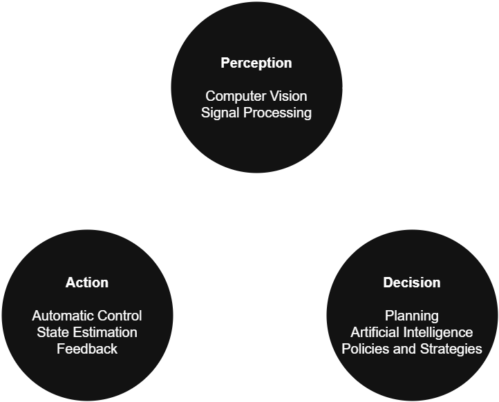
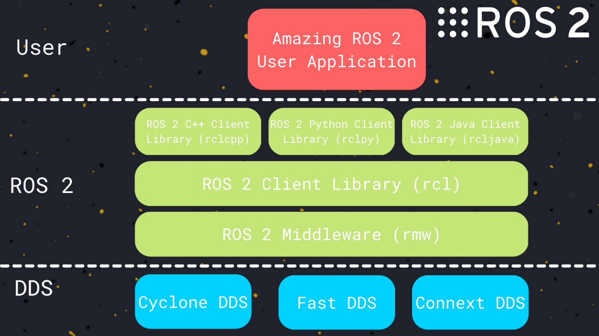

# 🏗️ System Architecture

### [🏠 Home](../) | [📺 Demo](../demo) | [🏗️ Architecture](./) | [📄 Documentation](../documentation)

---

## 🗺️ System Overview

*Figure 2: Interaction between Hardware, Firmware, and Cloud layers.*

## 🔌 Hardware Subsystems
*   **Main Controller:** [e.g., Jetson Nano for Image Processing]
*   **Actuation:** [e.g., 6x High-torque Brushless Motors via CAN Bus]
*   **Power:** [e.g., 6S LiPo with custom BMS]

## 🧠 Software Logic
<!-- 
  You can also use small GIFs for software flows or UI logic 
-->

  

The software stack is built on [ROS2/Arduino/etc]. 
1. **Perception Layer:** Processes IMU and Vision data.
2. **Decision Layer:** Calculates Inverse Kinematics.
3. **Execution Layer:** Sends PWM signals to motor drivers.

 

---
[Review Technical Documents →](../documentation)